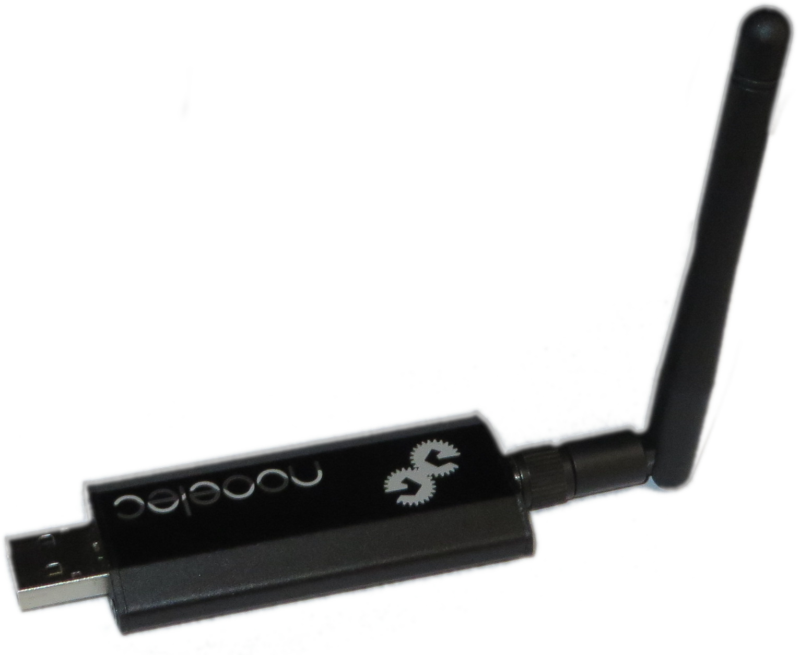

---

revealOptions:
  transition: fade
  title: Backup
  animate: true
  controls: true
  progress: true

---

# Was funkt denn da?

----

<table>
  <tr>
    <td style="text-align: center">
       
      Daniel Zerlett 
      Software Architect 
       
      Tüftler, Maker, Hacker und
      Funkamateur (DL1ZD) 
    </td>
    <td width="50">
    </td>
    <td style="text-align: center">
      Wolfram Quester 
      Physiker, Product Owner, Scrum Master  
       
      Segler, Bastler, Mädchen für alles
    </td>
  </tr>
</table>

---

## Elektromagnetisches Spektrum

 
<a style="font-size: 0.5em" title="Matt, CC BY-SA 2.5 &lt;https://creativecommons.org/licenses/by-sa/2.5&gt;, via Wikimedia Commons" href="https://commons.wikimedia.org/wiki/File:EM-Spektrum.svg">Quelle: https://commons.wikimedia.org/wiki/File:EM-Spektrum.svg</a>

----

## Meilensteine der Nachrichtentechnik

  * 1820: Entdeckung des Elektromagnetismus
  * 1888: 10 Meter weite Übertragung (H. Hertz)
  * 1901: Marconi morst über den Atlantik
  * 1906: Erste Übertragung eines Unterhaltungsprogramms zu Weihnachten
  * 1912: Untergang der Titanic
  * 1920er: Erste Fernsehübertragung
  * 1950: Funkmeldeempfänger ("Pager") in USA
  * 1953: NTSC-Farbfernsehen
  * 1958: A-Netz (erstes analoges deutsches Funktelefonnetz)
  * 1992: D-Netz
  * ...

---

## Drahtlose Kommunikation

  * Radio, TV (AM, FM, DAB, DVB)
  * Mobiltelefon (GSM, LTE etc.)
  * Betriebs- und Seefunk
  * Satellitennavigation
  * Wireless LAN (WiFi)  
  * Bluetooth
  * IoT (Zigbee, Z-Wave, WMBus, BLE...)
  * ...?

---

# Anwendungen

  * Funkthermometer
  * Wetterstationen
  * Funksteckdosen
  * Garagentoröffner
  * Autoschlüssel
  * Reifendruckkontrollsysteme
  * ADS-B (Flugzeugtransponder)
  * Radiosonden (Wetterballons)

----

# Gemeinsamkeiten der genannten Anwendungen

  * Die Kommunikation dieser Protokolle ist Unicast/Simplex
  * meistens Amplitudenmodulation (ASK)
  * ...oder Frequenzmodulation (FSK)
  * UHF-Band
  * kurze Nachrichten
  * seltenst verschlüsselt
  * einfach&#8482; zu empfangen &#9758;&#9786;
  
----

## ASK/FSK

----

## Interessante Frequenzbereiche

 
  * 100 MHz: FM-Radio
  * 434 MHz: Thermometer, Autoschlüssel etc.
  * 868 MHz: WMBUS, Alarmanlagen, etc.
  * 1090 MHz: ADS-B (Luftfahrzeugtransponder)

<a style="font-size: 0.5em" title="Matt, CC BY-SA 2.5 &lt;https://creativecommons.org/licenses/by-sa/2.5&gt;, via Wikimedia Commons" href="https://commons.wikimedia.org/wiki/File:EM-Spektrum.svg">Quelle: https://commons.wikimedia.org/wiki/File:EM-Spektrum.svg</a>

---

# Hardware

Welche Geräte/Ausrüstung brauche ich um diese Signale empfangen zu können

#### ❓❓❓

----

## rtl-sdr

 

  * ca. 25€
  * max. Bandbreite 2.4MS/s
  * RX 24MHz bis 1766MHz

----

 

  * ca. 40€
  * max. Bandbreite 3.2MS/s
  * RX 24MHz bis 2.2GHz mit Lücke bei ca. 1GHz

----

## Antennen

 
  
  * Eigenbau 433 MHz Dipol

----

## Antennen

 

  * Eigenbau 1090 MHz Groundplane

----

## HackRF One

 

  * ca. 300€
  * halbduplex
  * 1MHz bis 6GHZ 😀
  * SDR mit 20MS/s

----

## YardStick one

 

  * ca. 99€
  * halbduplex
  * High-Level RF-Interface, kein SDR (CC1111)
  * TX 300-348 MHz, 391-464 MHz und 782-928 MHz
  * ASK, OOK, GFSK, 2-FSK, 4-FSK, MSK
  * max. 500kbps

---

## Software

Welche Software brauche ich um diese Signale empfangen und decodieren zu können

#### ❓❓❓

----

## GQRX

  * Einfacher SDR-Empfänger mit GUI
  * Schöne Spektral- und Wasserfallansicht
  * Demodulatoren für AM/FM/SSB etc.

Note: FM-Radio empfangen, lokaler Stick (blau)

----

## rtl_433

  * Konsolenprogramm
  * https://github.com/merbanan/rtl_433
  * Empfängt viele Wetterstationen und RDK-Systeme etc.

Note:
 * Thermometer und Reifen live
 * Playback
 * raspberry Stick

----

### Warum packt der sein Thermometer in den Kühlschrank?

oder

### Gut dass es draußen kälter ist als drinnen!

----

## urh

  * "Investigate wireless protocols like a boss"
  * https://github.com/jopohl/urh

Note: Thermometer manuell decodieren

----

## selber senden?

  * Bitte Gesetze beachten!
  * Replay-Attacke/Spoofing mit Yard Stick One
  * https://github.com/b00lduck/433mhz_thermo_spoof

----

## dump_1090

  * ADSB-Signale empfangen und decodieren
  * https://github.com/antirez/dump1090

Note: mit raspberry und website

----

## gnuradio-companion

Note: FM TX
